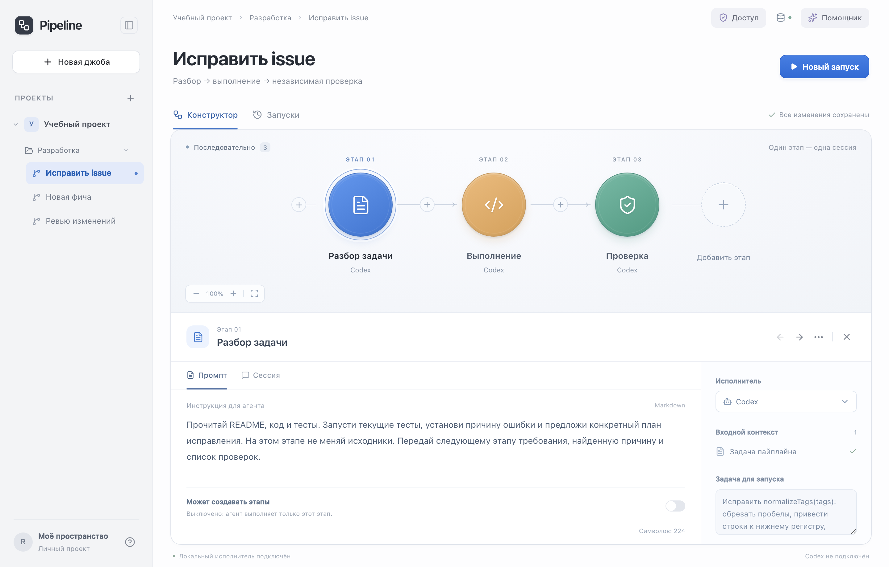

<p align="center">
  
</p>

<h1 align="center">Pipeline Studio</h1>

<p align="center">Собирайте повторяемые задачи из отдельных сессий Codex.<br>Задавайте промпт каждому этапу и передавайте дальше результаты и файлы.</p>

<p align="center">
  <a href="README.md">English</a> · Русский
</p>

<p align="center">
  <a href="https://github.com/ruslan-shaydullin/pipeline-studio/actions/workflows/ci.yml"></a>
  <a href="LICENSE"></a>
  <a href="package.json"></a>
</p>

<p align="center">
  <a href="#быстрый-старт">Быстрый старт</a> · <a href="#первый-пайплайн">Первый пайплайн</a> · <a href="docs/user-guide.ru.md">Руководство</a> · <a href="#документация">Документация</a>
</p>

<p align="center"><strong>Ранний прототип · Локально, для одного пользователя · Интерфейс на русском</strong></p>



_Конструктор с синтетическим примером. Реальный запуск Codex не выполнялся._

## Что можно делать

- **Собирать повторяемые джобы.** Организуйте шаблоны по проектам и папкам, задавайте промпты этапов и выбирайте модель перед запуском.
- **Следить за сессиями.** Смотрите команды, вывод, изменения файлов и переписку; отвечайте на вопросы и отправляйте уточнения во время работы.
- **Продолжать готовую работу.** Отдельные сессии автоматически передают результаты и файлы. Повторяйте этапы или дополняйте завершённый запуск, сохраняя прежние попытки.
- **Проверять и расширять план.** Получайте предложения помощника и применяйте их явно или разрешайте этапу-планировщику создавать следующие шаги.
- **Управлять данными локально.** Выбирайте режим доступа, экспортируйте и импортируйте шаблоны, восстанавливайте джобы из резервной копии. Запуски сохраняют собственную историю выполнения.

## Быстрый старт

Установите **Node.js 22.13+**, npm, Git и [Codex CLI](https://developers.openai.com/codex/cli). Основная проверенная платформа — macOS; CI на Linux проверяет установку, тесты и сборку. Другие платформы могут потребовать доработки интеграции.

```sh
git clone https://github.com/ruslan-shaydullin/pipeline-studio.git
cd pipeline-studio
npm ci
codex login
npm run dev
```

Откройте [localhost:3000](http://localhost:3000). Команда запускает интерфейс на `localhost:3000` и локальный исполнитель на `127.0.0.1:4317`. Закрытие вкладки не останавливает работу; остановка сервера прерывает сессии, сохраняя их историю.

На macOS исполнитель сначала ищет CLI в `ChatGPT.app`, затем использует `codex` из `PATH`. Чтобы использовать CLI из терминала, выполните `PIPELINE_CODEX_BIN="$(command -v codex)" npm run dev`. Авторизуйтесь тем исполняемым файлом, который использует исполнитель. Адаптер проверен с `codex-cli 0.153.4`; другие версии могут потребовать доработки интеграции. Запуски используют лимиты вашего аккаунта.

## Первый пайплайн

Откройте **«Исправить issue» → «Новый запуск»**. В форме уже выбрана папка [`examples/issue-lab`](examples/issue-lab): небольшой проект с тремя намеренно падающими тестами. Начните запуск, чтобы увидеть работу трёх отдельных сессий:

1. **Разбор задачи:** изучить issue и воспроизвести ошибки в тестах.
2. **Выполнение:** получить результаты разбора и копию файлов, исправить код.
3. **Проверка:** проверить исправление в новой сессии и сообщить результат.

Нажмите на этап, чтобы открыть его диалог. Исходный пример остаётся доступен для следующего запуска: агенты работают с отдельными копиями. Для своей задачи выберите папку проекта или начните без файлов.

После завершения кнопка **«Продолжить»** добавит работу к тому же запуску. **«Повторить отсюда»** создаст новую попытку и заново выполнит последующие этапы. [Чем отличаются продолжение и повтор →](docs/user-guide.ru.md#продолжение-повтор-и-новый-запуск)

## Текущие ограничения

Этапы выполняются последовательно, дополнительные запуски ждут в очереди. Одновременно может работать один разбор помощника. Ветвления и параллельных этапов пока нет, единственный подключённый исполнитель — Codex. Черновики сообщений исчезают при перезагрузке страницы; рабочие копии нужно удалять самостоятельно.

Оставляйте исполнитель на своём компьютере: многопользовательской авторизации нет. Копия проекта не ограничивает сессию в режиме полного доступа — она работает с правами пользователя ОС. [Режимы доступа и работа с файлами →](docs/user-guide.ru.md#режимы-доступа)

## Документация

- [Руководство пользователя](docs/user-guide.ru.md): сессии, продолжение, помощник, доступ и локальные данные.
- [Правила участия](CONTRIBUTING.md) и [процесс разработки](docs/development-workflow.md): настройка, проверки и PR.
- [Архитектура](docs/architecture.md): данные, выполнение и гарантии хранения.
- [Подготовка релиза](docs/releases.md): проверка и публикация версии.

Независимый проект, не официальный продукт OpenAI. Лицензия — [MIT](LICENSE).
